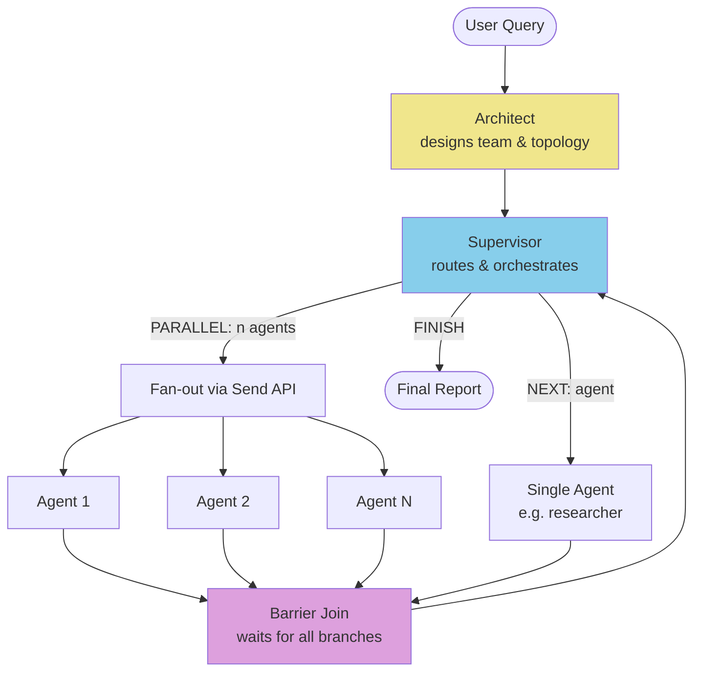

# Flexi: A Controlled Study of Flexible vs. Rigid Agentic Architectures

**Research question**: Does giving a LangGraph-based research system the ability to define its own agent roles (free-form architecture) improve output quality and reduce cost compared to a fixed, well-grounded role set?

**Finding**: No — the experimental "flexible" architecture underperformed on both dimensions: 80% vs 100% pass rate, and 89% higher costs. The failure mode is instructive: the regression is not generic "too much autonomy" — it traces to a specific compound failure of supervisor routing loop-lock on custom role names combined with a synthesis-tier model hallucinating non-executable tool calls. See [`examples/`](examples/) for the full comparative evaluation including the mechanistic failure analysis.

This has direct implications for agentic system design: **well-grounded role definitions act as a shared vocabulary between the supervisor LLM and the routing layer**. When that vocabulary is improvised at runtime, weaker strategic models lose reliable termination signals — a pattern likely to resurface in any system routing between dynamically-named agents. This is a concrete instance of the broader agent reliability challenge studied in frameworks like AutoGen and CrewAI, where supervisor routing robustness is the primary determinant of whether complex multi-agent workflows complete or degrade into loops.

---

## Architecture & Agents

The system uses a dynamic team of specialized agents, orchestrated by LangGraph. Among them:

- **The Architect**: The strategic planner. It analyzes the user query and designs a custom graph topology (e.g., "We need 3 parallel researchers for this comparison").
- **The Researchers**: Specialized data gatherers. Can search the external web (DuckDuckGo) or internal knowledge bases (ChromaDB) in parallel.
- **The Analyst**: The conflict resolver. Its system prompt instructs it to synthesize contradictory findings (e.g., "Source A vs Source B") into a coherent narrative.
- **The Supervisor**: The router. Manages the control flow, ensuring the research stays on track and terminates when complete.

### System Flow



*Each agent only receives its own prior turns + findings from declared dependencies (episodic memory). The supervisor sees only a findings summary — not the full message history.*

## Evaluation Harness

A unified evaluation engine (`src/flexi/evals/runner.py`) ensures reliability across different configurations.

- **Unified Engine**: Single runner for both quick sanity checks and comprehensive stress tests.
- **Architectural Flexibility**: Capable of testing "flexible" architectures (Architect designs the team) vs "rigid" ones (fixed graph).
- **Robustness**: Includes automatic tool validation (did it use the KB?) and resilient report extraction.
- **LLM-as-Judge**: Reports are scored on clarity, citation quality, reasoning coherence, and hallucination rate using a dedicated judge model.

### Evaluation Examples

See **[examples/](examples/)** for a curated selection of evaluation results demonstrating:

- **Comparative analysis**: Baseline vs. Experimental architecture performance
- **Quality metrics**: Clarity, citation quality, and reasoning depth scores
- **Cost analysis**: Token usage and API cost breakdowns
- **Instructive failures**: Null results showing when flexibility underperforms structure, with mechanistic post-mortems

## Quick Start

### 1. Installation

```bash
uv pip install -e .
# Or with pip
pip install -e .
```

### 2. Environment Setup

Create a `.env` file:
```bash
OPENAI_API_KEY=sk-...
ANTHROPIC_API_KEY=sk-...
```

(Optional) For local models:
```bash
USE_OPENSOURCE_MODELS=true
OLLAMA_BASE_URL=http://localhost:11434
```

### 3. Running Evaluations

**Quick Sanity Check (Tier 1)**:
```bash
python src/flexi/evals/quick_eval.py
```
*Runs 3 simple questions to verify system stability.*

**Comprehensive Stress Test (Tier 2)**:
```bash
python src/flexi/evals/comprehensive_eval.py
```
*Runs 5 complex scenarios (Parallelism, Hybrid Search, Conflict Resolution).*

**Comparative Study**:
```bash
python src/flexi/evals/run_comparison.py --suite [quick|comprehensive]
```
*Runs A/B tests between Baseline (Strict Roles) and Experimental (Flexible Roles) regimes, generating a detailed `comparison_report.md` with quality and cost deltas.*

## Technical Design Highlights

Key non-trivial engineering decisions during development:

1. **Episodic Memory / Context Hygiene**: Implementing selective "search memory" — each agent restores only its own prior message turns from `state['messages']`, filtering out all other agents. This prevents token explosion in multi-turn loops while preserving per-agent continuity across supervisor handoffs (~90% token savings vs. full-history approach).

2. **Tiered Model Assignment**: Roles map to model tiers at runtime (`supervisor/architect → strategic`, `researcher → research (DeepSeek-R1)`, `writer/summarizer → synthesis (Gemini Flash)`), with per-role temperature configuration. This is a cost/quality design choice, not infrastructure overhead.

3. **Dynamic Fan-out with LangGraph `Send` API**: Parallel research branches are dispatched using `Send` rather than a fixed static graph, with a proper barrier/join node using `increment_counter` as a custom reducer that handles a `-1` reset signal.

4. **Resilient Tool Fallback**: `_extract_markdown_tool_calls()` handles models (e.g., smaller Llama variants) that emit tool calls as markdown JSON blocks rather than structured API calls — a pattern discovered through debugging open-source model behavior.

5. **Reasoning Trace Pruning**: `_prune_reasoning()` strips `<think>...</think>` tags from persistent message history — a concrete artifact of running DeepSeek-R1 in the research tier and finding that reasoning traces bloat the context without adding signal.

## Research Goals

This project serves as a testbed for investigating **flexible agentic architectures**:

1. **Open vs. Default Roles**: Comparing the efficacy of "rigid" pre-defined agent roles against dynamically generated ones.
2. **The Meta-Architect Pattern**: Introducing a strategic "Architect" layer that reasons about the *process* of research before execution begins.
3. **General-Purpose Research**: Building a versatile deep research engine capable of tackling diverse domains (technical, policy, market analysis) without code changes.

## Project Structure

- `src/flexi/agents/`: Core agent logic (Architect, Graph Builder, supervisor and agent executors).
- `src/flexi/evals/`: Unified evaluation engine (`runner.py`), LLM judge (`judges.py`), metrics, and test question sets.
- `src/flexi/core/`: State definitions with typed reducers, LLM provider abstraction, tool registry.
- `src/flexi/config/`: Tiered model config, role-temperature mapping, and `prompts.yaml` — the architect prompt template that defines the experimental variable in the A/B comparison (the instructions given to the Architect differ between baseline and experimental regimes).
- `examples/`: Curated evaluation results with traces, including the comparative A/B study.
- `tests/unit/`: 8 unit tests covering the non-trivial logic — parallel join state management, supervisor decision parsing, context hygiene filtering, reasoning trace pruning, and markdown tool call extraction. These test the components most likely to fail silently across model upgrades.

---
*Built in collaboration with Google DeepMind's Antigravity.*
